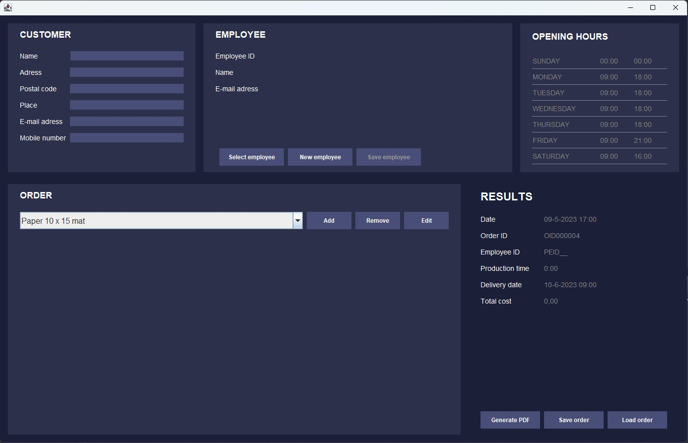
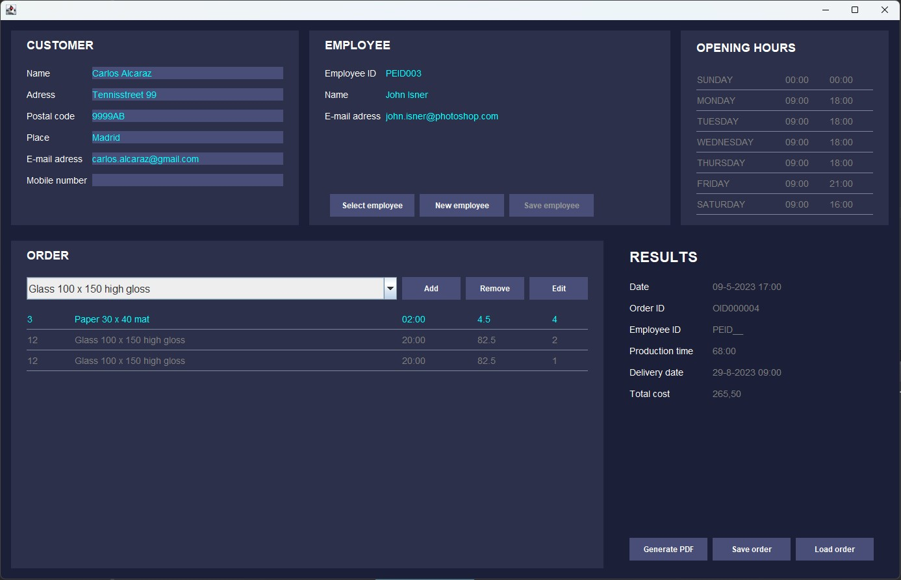

# Example-OrderProcessing-Application-for-Photos
 
**Luuk van Waveren - May 2023**

During my IT Traineeship I made an Example Java application as a test of my beginner programming skills. The fictional setting entails a shop that sells photos.
An employee of the shop creates orders using this application on the customers behalf and gets information on the costs and delivery date where photo printing is 

The application has the following functionallity:
- (optional) Enter customer contact details
- Create or Select an employee
- Add products to the order, where the product name tells the size and photo type. Each line represents a different photo of the customer
- Save and load orders to and from XML for data persistance
- Generate a Pdf invoice of the order
- The order results show the total costs and when the order can be picked up in the shop.

If java (1.8) is installed, test the app instantly by [Downloading](GitHubReadmeFiles\RunnableJar\) the runnable jar with folders and running the jar.

## Example

  
